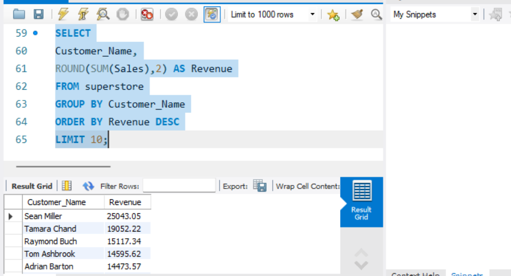
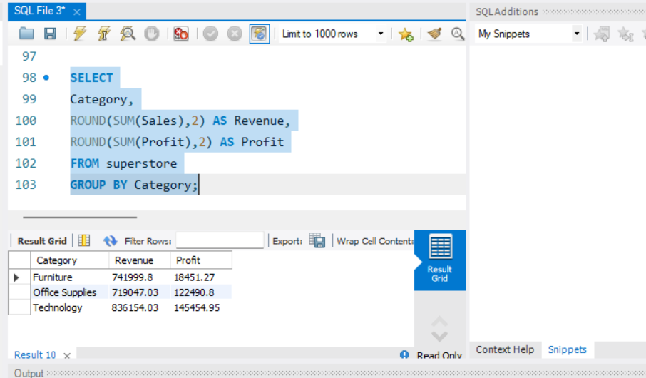
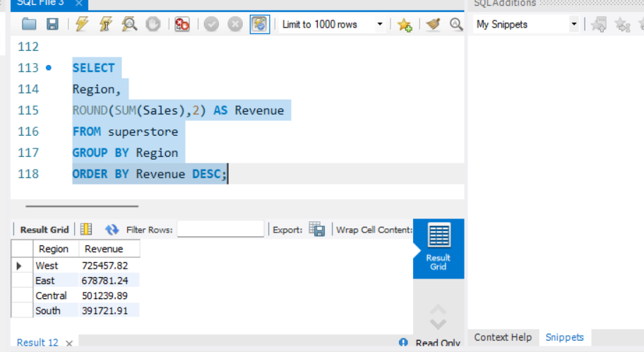
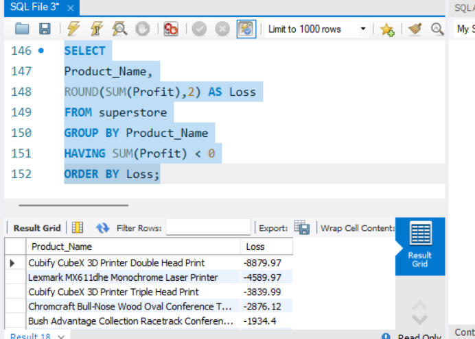

# 🛒 Retail Sales Analytics using SQL

## 📌 Project Overview

This project analyzes retail sales transactions from the Superstore dataset to uncover insights into customer behavior, product performance, profitability, and regional sales trends.

Using MySQL, I performed end-to-end business analysis to identify revenue drivers, high-value customers, profitable product categories, and loss-making products that impact business growth.

---

## 🎯 Business Problem

Retail businesses generate thousands of transactions, making it difficult to identify:

- Which customers contribute the most revenue
- Which products drive profitability
- Which regions perform best
- Which products generate losses
- How sales and profit vary across categories

This project provides data-driven answers to support business decision-making.

---

## 🛠 Tools & Technologies

- SQL (MySQL)
- Python
- Pandas
- SQLAlchemy
- GitHub

---

## 📊 Dataset

**Dataset:** Superstore Sales Dataset

**Records:** ~9,994 Transactions

### Key Fields

- Customer Information
- Product Information
- Order Details
- Sales
- Profit
- Quantity
- Discount
- Region
- Category

---

# 📈 Dashboard & Query Outputs

## Top Customers by Revenue



### Business Insight

A small group of customers contributes a significant portion of total revenue. These customers should be prioritized for retention and loyalty programs.

---

## Category Performance Analysis



### Business Insight

Analyzed revenue and profitability across categories to identify high-performing business segments.

---

## Regional Sales Analysis



### Business Insight

Compared sales performance across regions to identify strong and weak markets.

---

## Loss-Making Products



### Business Insight

Identified products generating negative profit despite sales activity, highlighting opportunities for pricing and inventory optimization.

---

# 📋 Business Questions Solved

### Sales Analysis

- Total Revenue
- Total Orders
- Average Order Value
- Monthly Sales Trends

### Customer Analysis

- Top Customers
- Customer Lifetime Value (CLV)
- Segment Performance

### Product Analysis

- Top Products
- Category Performance
- Sub-Category Analysis

### Regional Analysis

- Regional Revenue Comparison
- State-Level Sales Analysis
- Regional Profitability

### Profitability Analysis

- Overall Profit
- Profit Margin
- Loss-Making Products

---

# 🧠 SQL Skills Demonstrated

### Aggregations

```sql
SUM()
COUNT()
AVG()
ROUND()
```

### Grouping & Filtering

```sql
GROUP BY
HAVING
ORDER BY
LIMIT
```

### Window Functions

```sql
RANK()
OVER()
```

### Common Table Expressions (CTEs)

```sql
WITH
```

### Date Functions

```sql
YEAR()
MONTH()
```

---

# 📂 Project Structure

```text
sql-retail-sales-analytics/
│
├── data/
│   └── superstore.csv
│
├── sql/
│   ├── 01_create_tables.sql
│   ├── 02_sales_analysis.sql
│   ├── 03_customer_analysis.sql
│   ├── 04_product_analysis.sql
│   ├── 05_regional_analysis.sql
│   ├── 06_profit_analysis.sql
│   └── 07_advanced_queries.sql
│
├── outputs/
│   ├── screenshots/
│   └── results/
│
├── import_superstore.py
│
└── README.md
```

---

# 🔍 Sample SQL Query

```sql
SELECT
    Customer_Name,
    ROUND(SUM(Sales),2) AS Revenue
FROM superstore
GROUP BY Customer_Name
ORDER BY Revenue DESC
LIMIT 10;
```

---

# 💡 Key Outcomes

✔ Identified top revenue-generating customers

✔ Analyzed product-level profitability

✔ Compared regional sales performance

✔ Detected loss-making products

✔ Applied advanced SQL techniques including Window Functions and CTEs

✔ Generated actionable business insights from retail transaction data

---

# 🚀 Future Enhancements

- Interactive Power BI Dashboard
- RFM Customer Segmentation
- Customer Churn Analysis
- Sales Forecasting
- Executive KPI Dashboard

---

# 👩‍💻 Author

**Jagadeeswari S**

Aspiring Data Analyst

### Skills

SQL • Python • Power BI • Machine Learning • Data Visualization

### GitHub

https://github.com/jagadeeswari-19

### LinkedIn

https://www.linkedin.com/in/jagadeeswari-s-jagadeeswari/?skipRedirect=true

