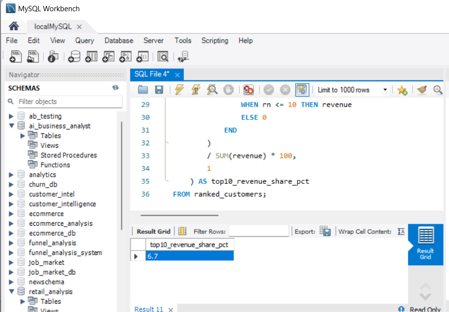

# 🛒 Retail Sales Analytics — MySQL

A SQL-based retail sales analytics project using **MySQL** to analyze **9,994 Superstore transactions**, uncover sales and profitability trends, identify high-value customers and products, and detect loss-making products.

The project demonstrates practical SQL skills including **CTEs, subqueries, aggregations, joins, CASE statements, window functions, date analysis, and business-oriented KPI analysis**.

---

## 📌 Project Overview

This project analyzes **9,994 retail transactions** from the Superstore dataset to answer practical business questions around:

* Sales and profit performance
* Customer revenue contribution
* Product profitability
* Regional performance
* Category and sub-category performance
* Monthly sales trends
* Loss-making products
* Revenue concentration
* Top-performing customers and products

The analysis was performed using **MySQL**, with SQL queries organized by analytical topic.

---

## 🎯 Business Objectives

The project focuses on answering questions such as:

1. Which customers generate the most revenue?
2. Which products contribute the most sales and profit?
3. Which products are generating losses?
4. Which regions and categories perform best?
5. How do sales and profit change over time?
6. How concentrated is revenue among the top customers?
7. Which products require further business attention?

---

## 🗂️ Project Structure

```text
retail-sales-analytics/
│
├── data/
│   └── superstore.csv
│
├── sql/
│   ├── 01_data_exploration.sql
│   ├── 02_customer_analysis.sql
│   ├── 03_product_analysis.sql
│   ├── 04_sales_trends.sql
│   ├── 05_cte_window_analysis.sql
│   └── 06_profit_analysis.sql
│
├── outputs/
│   └── screenshots/
│       ├── top10_customer_revenue_share.png
│       ├── sales_profit_trend.png
│       └── loss_making_products.png
│
└── README.md
```

---

## 🧰 Tools & Technologies

* **MySQL**
* SQL
* MySQL Workbench
* CTEs
* Window Functions
* Subqueries
* Aggregate Functions
* Joins
* CASE Statements
* Date Functions
* Git & GitHub

---

## 🔎 SQL Analysis

### 1. Customer Analysis

Analyzed customer-level sales and revenue contribution to identify high-value customers.

Key analysis includes:

* Total revenue by customer
* Total profit by customer
* Top 10 customers by revenue
* Customer revenue contribution
* Revenue concentration

---

### 2. Product Analysis

Analyzed product-level performance to identify products driving sales and profitability.

Key analysis includes:

* Top products by sales
* Top products by profit
* Product-level revenue
* Product-level profitability
* Loss-making products

---

### 3. Sales Trend Analysis

Analyzed sales performance across time to identify trends and changes in business performance.

Key analysis includes:

* Monthly sales
* Monthly profit
* Yearly performance
* Sales growth
* Profit trends

---

### 4. Regional & Category Analysis

Analyzed business performance across different regions, categories, and sub-categories.

Key analysis includes:

* Regional sales
* Regional profit
* Category performance
* Sub-category performance
* Profitability comparison

---

## 🧠 CTE & Window Function Analysis

The project includes advanced SQL techniques such as **Common Table Expressions (CTEs)** and **window functions**.

Example:

```sql
WITH customer_revenue AS (
    SELECT
        Customer_Name,
        SUM(Sales) AS total_revenue
    FROM retail_sales
    GROUP BY Customer_Name
),
ranked_customers AS (
    SELECT
        Customer_Name,
        total_revenue,
        RANK() OVER (ORDER BY total_revenue DESC) AS revenue_rank
    FROM customer_revenue
)
SELECT
    Customer_Name,
    total_revenue,
    revenue_rank
FROM ranked_customers
WHERE revenue_rank <= 10
ORDER BY revenue_rank;
```

This query calculates customer-level revenue and ranks customers based on total revenue.

---

## 📉 Profitability Analysis

One of the key findings from the analysis was the identification of products generating negative total profit.

| Metric               |      Result |
| -------------------- | ----------: |
| Total Transactions   |       9,994 |
| Loss-Making Products |         301 |
| Aggregate Loss       | -$77,068.38 |

The analysis identified **301 products with negative total profit**, generating a combined loss of **$77,068.38**.

This provides a useful starting point for investigating pricing, discounting, product costs, and other profitability drivers.

---

## 📊 Analysis Screenshots

### Top 10 Customer Revenue



### Sales & Profit Trend


### Loss-Making Products


---

## 💡 Key Business Insights

The analysis focuses on several business-oriented insights:

* Identifying high-value customers based on revenue contribution.
* Measuring revenue concentration among top customers.
* Identifying products generating negative total profit.
* Comparing sales and profitability across regions.
* Evaluating category and sub-category performance.
* Tracking monthly sales and profit trends.
* Using SQL ranking techniques to prioritize high-performing customers and products.

---

## ▶️ How to Run

### 1. Clone the repository

```bash
git clone https://github.com/jagadeeswari-19/retail-sales-analytics.git
```

### 2. Open MySQL Workbench

Create a database for the project:

```sql
CREATE DATABASE retail_sales;
USE retail_sales;
```

### 3. Load the dataset

Import the Superstore dataset into MySQL and create the required table.

### 4. Run the SQL scripts

Execute the SQL files in the `sql/` directory according to the analysis you want to perform.

For example:

```text
01_data_exploration.sql
02_customer_analysis.sql
03_product_analysis.sql
04_sales_trends.sql
05_cte_window_analysis.sql
06_profit_analysis.sql
```

---

## 📁 Dataset

The project uses the **Superstore retail sales dataset**, containing transaction-level information such as:

* Order details
* Customer information
* Product information
* Sales
* Quantity
* Discount
* Profit
* Region
* Category
* Sub-category
* Order dates

---

## 📌 Skills Demonstrated

**SQL:**
Joins • CTEs • Window Functions • Subqueries • Aggregations • CASE • Date Functions • Ranking • Filtering

**Data Analysis:**
Customer Analysis • Product Analysis • Sales Analysis • Profitability Analysis • Trend Analysis • Revenue Concentration

**Business Analytics:**
KPI Analysis • Performance Analysis • Loss Identification • Revenue Analysis • Business Insights

---

## 👩‍💻 Author

**Jagadeeswari S.**

B.Tech — Artificial Intelligence & Data Science

GitHub: [jagadeeswari-19](https://github.com/jagadeeswari-19)

---


